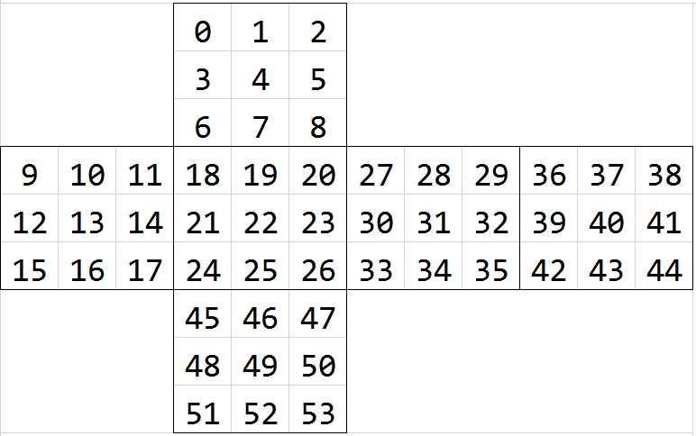

Cube definations
===
#Faces
The faces of the cube are defined as the picture.

The face with center number `22` is defined as the face in the front.

And then, the upper one is the top face, the left one is the left face, and so on.

#Turns
Every two directions of each 3 directions are provided.

#Rotations
As the hint defines in `cube.hh`

We use `14` chars to represent the moves, including `8` rotations and `6` turns.

Assume that the face with number `22` is in the front.

* `uo`: horizonly turn the cube left or right as a whole
* `jl`: turn the cube clockwise or counter-clockwise as a whole, whose axis is parralel with your sight
* `ik`: turn the cube up or down as a whole
* `qa`: rotate the left column up or down
* `rf`: rotate the right column up or down
* `24`:	rotate the top row left or right
* `zc`:	rotate the bottom row left or right

Every operation you conducted to the cube can be represented by a sequence of the operations above.

#Edges and corners
All numbered from 0, from top to button in counter-clockwise, with your eyes above the cube.

Start from the left front cube, or the front cube.

#Colors
Integer from `0` to `5`.

By default, they refers to colors as follow.
* 0: Blue,
* 1: Red
* 2: Yellow
* 3: Orange
* 4: White
* 5: Green

